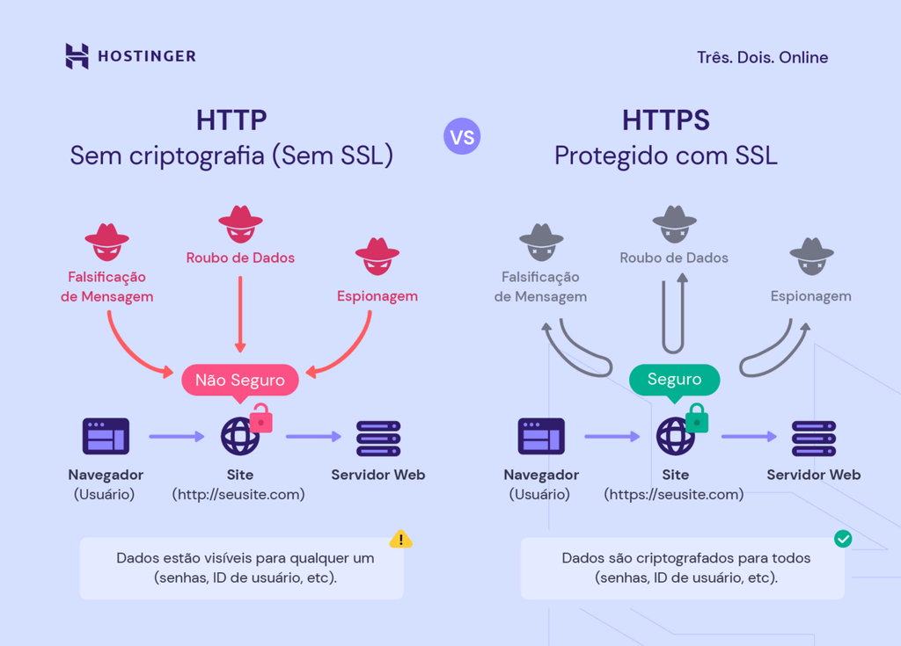

# Mutual Transport Layer Security ​(mTLS)​

Protocolo de Segurança para comunicação segura entre duas partes sobre a internet​.

## Apresentação

### O que é mTLS?
 
- O TLS mútuo, ou mTLS, é um método para autenticação mútua. ​
- Ele assegura que as partes em cada extremidade de uma conexão de rede são quem afirmam ser, verificando que ambas têm a chave privada correta. ​
- As informações dentro de seus respectivos certificados TLS fornecem a verificação adicional.​

### O que é TLS?

- Transport Layer Security (TLS) é um protocolo de criptografia muito usado na internet. ​
- O TLS, antes era chamado SSL. ​
- Ele autentica o servidor em uma conexão cliente-servidor e criptografa as comunicações entre cliente e servidor para que as partes externas não possam espionar as comunicações.​

### Para que serve TLS?



### Como funciona o TLS?

Normalmente em TLS, o servidor tem um certificado TLS e um par de chaves pública/privada, mas o cliente não tem.  
O processo típico do TLS funciona assim:​


### Como funciona o mTLS?

No mTLS, tanto o cliente quanto o servidor têm um certificado e ambos os lados autenticam usando seu par de chaves pública/privada.  
O processo típico do mTLS funciona assim:​


## Hands on

### Rodando a aplicação

#### Requisitos:

- NodeJS
- Yarn

#### Rodando:

- Servidor A: ```/server $ yarn deva```
- Servidor B: ```/server $ yarn devb```

#### Requisições para Server A

*Requisição http:*
```sh
curl http://localhost:3000/ping
```

*Requisição https:*
```sh
curl --insecure https://localhost:3442/ping
```

*Requisição mTLS:*
```sh
curl --insecure \
  --cacert ./ca/ca.crt \
  --key ./client/client.key \
  --cert ./client/client.crt \
  https://localhost:3443/ping
```

#### Requisições para Server B

*Requisição http:*
```sh
curl http://localhost:3001/ping
```

*Requisição https:*
```sh
curl --insecure https://localhost:3444/ping
```

*Requisição mTLS:*
```sh
curl --insecure \
  --cacert ./ca/ca.crt \
  --key ./client/client.key \
  --cert ./client/client.crt \
  https://localhost:3445/ping
```

## Criação dos certificados

### Criação do certificado para o servidor

1. Criando a chave
```sh
openssl genrsa -out server.key 2048
```
2. Criando o certificado
```sh
openssl req \
  -new \
  -key server.key \
  -subj '/CN=localhost' \
  -out server.csr
```
```sh
openssl x509 \
  -req \
  -in server.csr \
  -days 365 \
  -signkey server.key \
  -out server.crt
```
3. Inspecionando o certificado
```sh
openssl x509 --in server.crt -text --noout
```

### Criação do certificado da CA (root)

1. Criando o certificado root
```sh
openssl req \
  -new \
  -x509 \
  -nodes \
  -days 365 \
  -subj '/CN=root-ca' \
  -keyout ca.key \
  -out ca.crt
```
2. Inspecionando o certificado root
```sh
openssl x509 --in ca.crt -text --noout
```
3. Criando o certificado do servidor assinado com a CA
```sh
openssl x509 \
  -req \
  -in server.csr \
  -CA ca.crt \
  -CAkey ca.key \
  -CAcreateserial \
  -days 365 \
  -out server-signed.crt
```
4. Inspecionando o certificado assinado
```sh
openssl x509 --in server-signed.crt -text --noout
```

## Fontes

- [Cloudflare](https://www.cloudflare.com/pt-br/learning/access-management/what-is-mutual-tls/#:~:text=O%20TLS%20m%C3%BAtuo%2C%20ou%20mTLS,TLS%20fornecem%20a%20verifica%C3%A7%C3%A3o%20adicional.)
- [Wikipedia](https://pt.wikipedia.org/wiki/Transport_Layer_Security)
- [Hostinger](https://www.hostinger.com.br/tutoriais/o-que-e-ssl-tls-https)
- [Mutual TLS Authentication (mTLS) De-Mystified](https://codeburst.io/mutual-tls-authentication-mtls-de-mystified-11fa2a52e9cf)